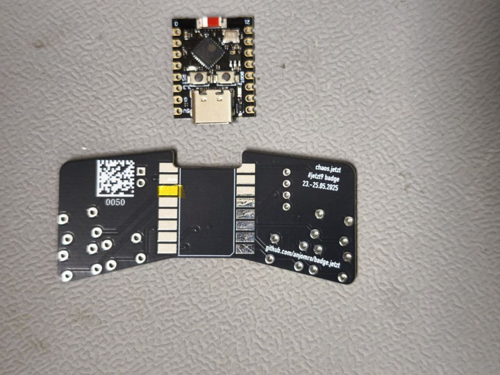
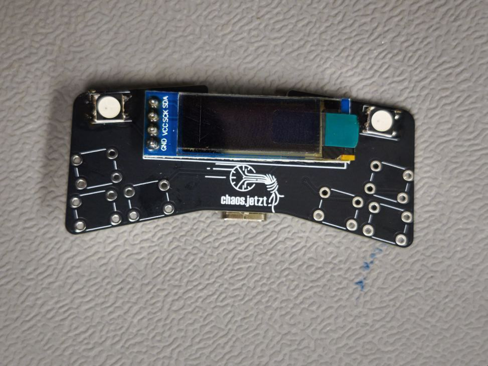

# badge.jetzt


## How to build the badge hardware

1. Get the PCB
2. Solder the ESP32-C3 module to the PCB
3. Solder the WS2812B LEDs to the PCB
   1. The LEDs have a white corner on one corner, this needs to be on the top left corner for both LEDs
4. Solder the OLED Display to the PCB
5. Solder the buttons to the PCB
6. Flash the software to the ESP32-C3 module
   1. Install [platformio](https://platformio.org/platformio-ide) or the [CLI](https://docs.platformio.org/en/latest/core/index.html)
   2. Clone the repository: `git clone git@github.com:anjomro/badge.jetzt.git`
   3. Upload the project, run `pio run -t upload`





## PlatformIO on different Systems:
**Arch**: `sudo pacman -Sy platformio-core`

**Debian**: TODO

**Nix**:
```Bash
git clone 'https://github.com/anjomro/badge.jetzt/tree/docs'
nix develop
pio run -t upload
```
